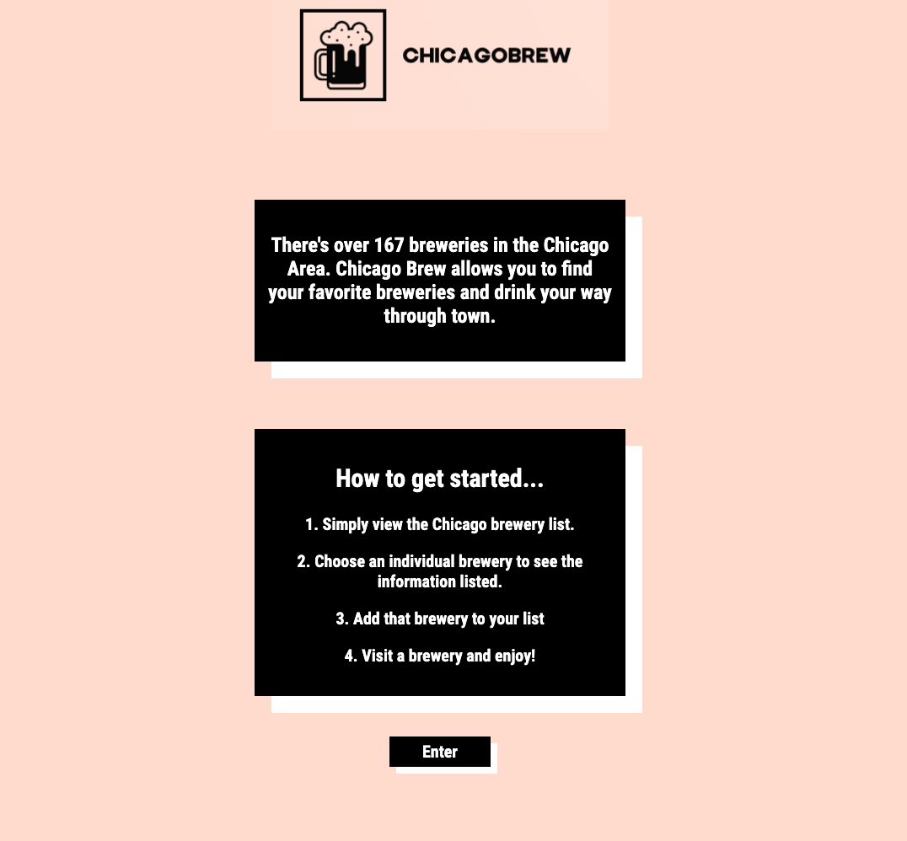
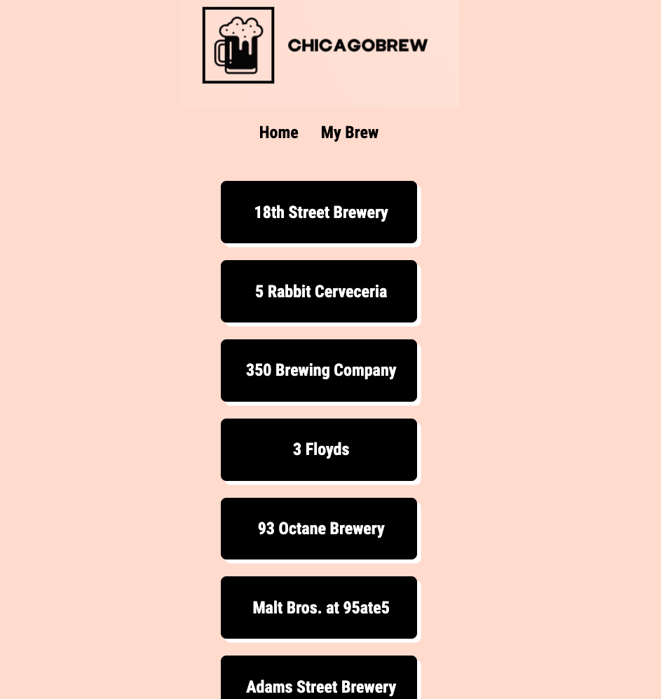
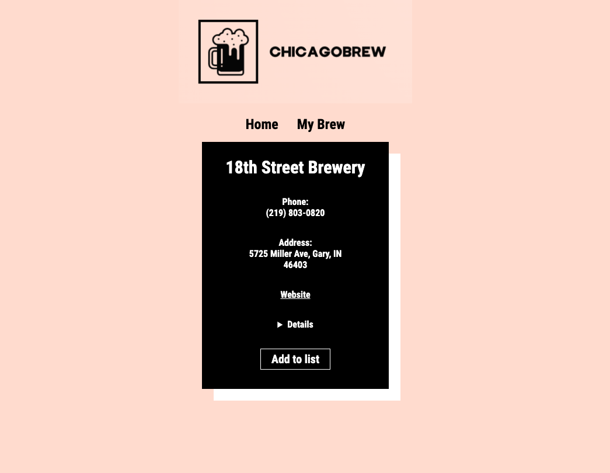
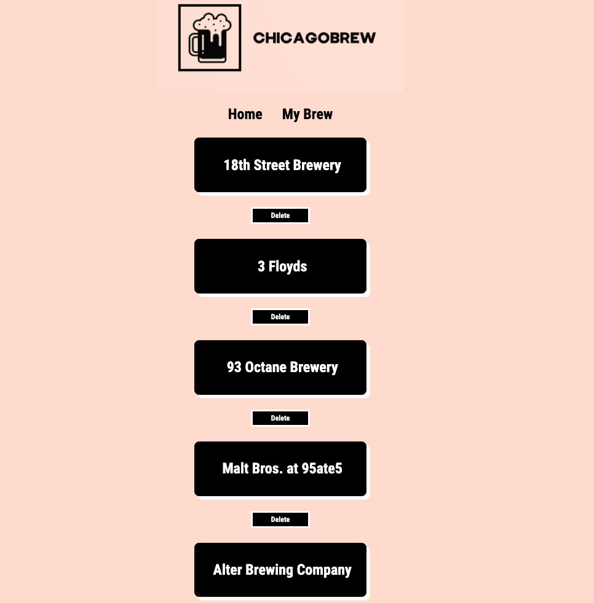

# ChicagoBrew 🍺

- [ChicagoBrew](https://chicagobrew.vercel.app/) is a fully responsive, server-side rendered web application that helps people in the Chicago area locate and enjoy the best breweries in town. The Back-End repo can be found [here](https://github.com/oliviadavis593/ChicagoBrew-API)

# Screenshots 📸
|  |
|:---:|
|Landing|

|  |  | 
|:---:|:---:|:---:|
|Dashboard|BrewPage|MyBrews|

# Development Phase ⚒ 
- I started my application with an HTML first approach for optimal component composition. I love developing this way as it really sets the tone for progressive enhancement. This allows me to specify what tools would best suit the project at hand before being too far in. React is always an obvious choice as its always about making visual components that represent the current state of the app. 

- On the backend, I built a RESTful API to serve all the data to the client. Using technologies such as Knex.js and Express.js make it a flawless and seamless experience to build out the entire API. I went with a TDD approach, getting the tests to progress from failing to passing, along with testing very specific circumstances along with normal cases which can alleviate any future errors when the application has already been deployed to production.  

# Tech Used 🖥

**Front-End**
- HTML5
- CSS3 
- [React](https://reactjs.org/) (Javscript Framework)

**Back-End**
- [Node](https://nodejs.org/en/)
- [Express](https://expressjs.com/)
- [PostgreSQL](https://www.postgresql.org/) (Relational Database Management System)

**Testing and Deployment**
- [Vercel](https://vercel.com/)(Cloud platform for static sites | Develop. Preview. Ship.)
- [Jest](https://jestjs.io/) (Front-End Framework Testing)
- [Enzyme](https://github.com/enzymejs/enzyme) (Front-End Framework Testing)
- [Mocha](https://mochajs.org/) (Back-End Framework Testing)
- [Chai](https://www.chaijs.com/) (Assertion Library For Node)
- [Heroku](https://www.heroku.com/platform) (Cloud PaaS)
